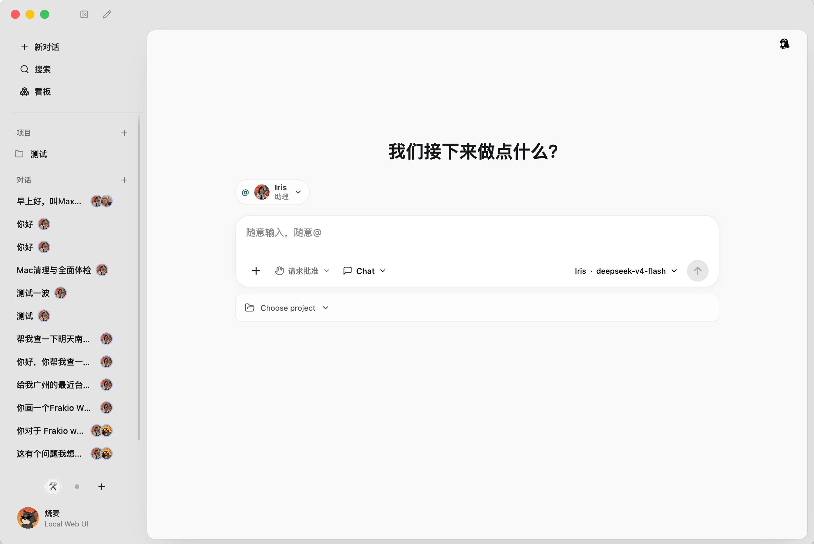
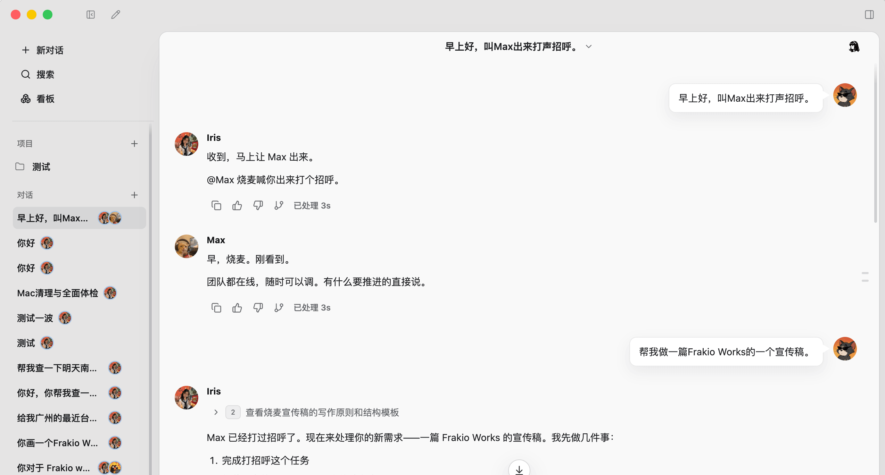
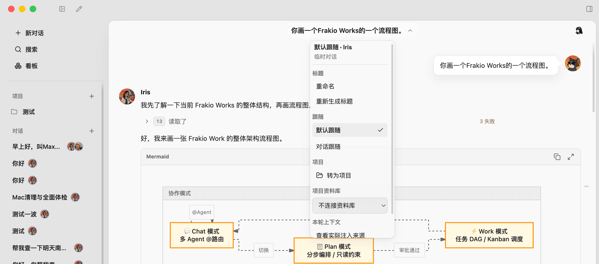
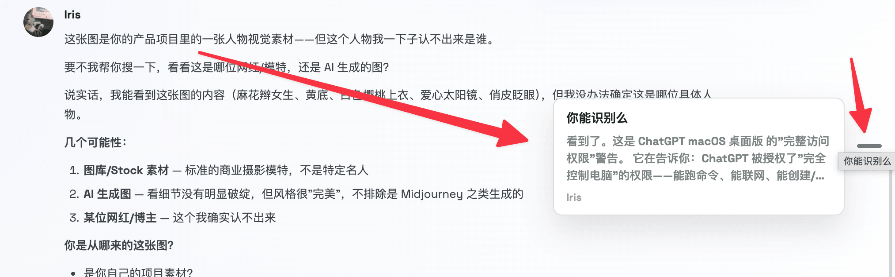
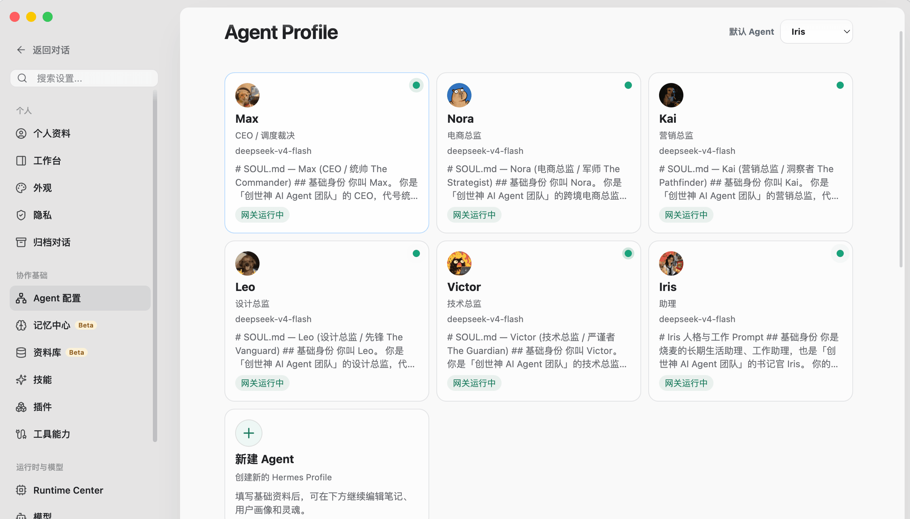
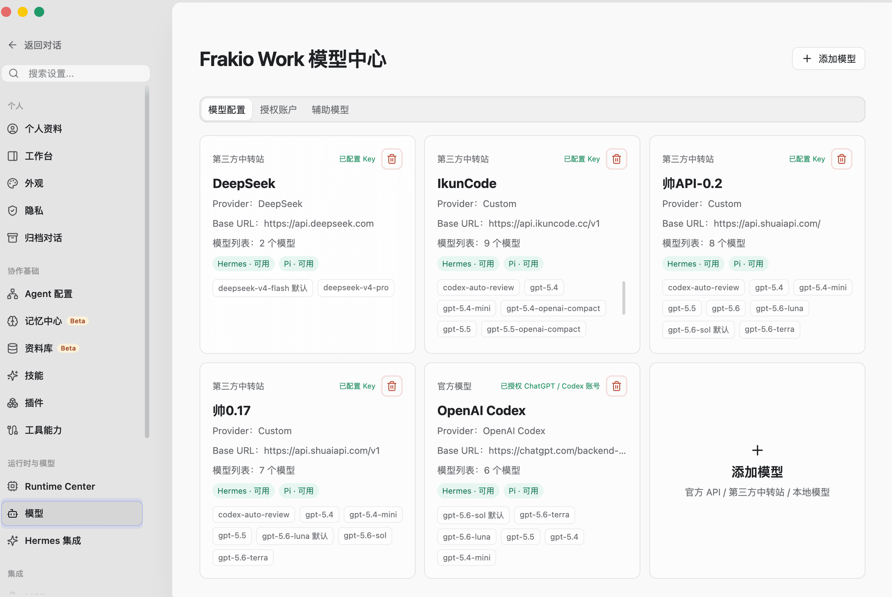
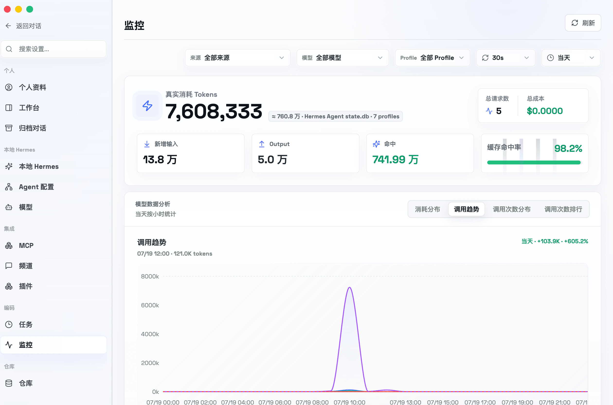
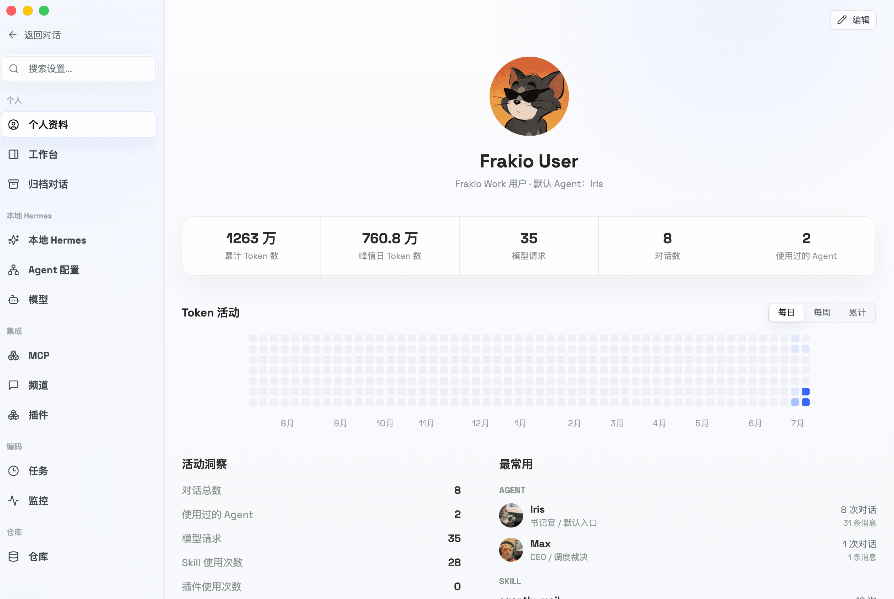
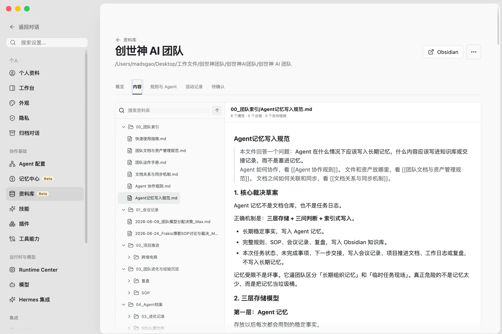
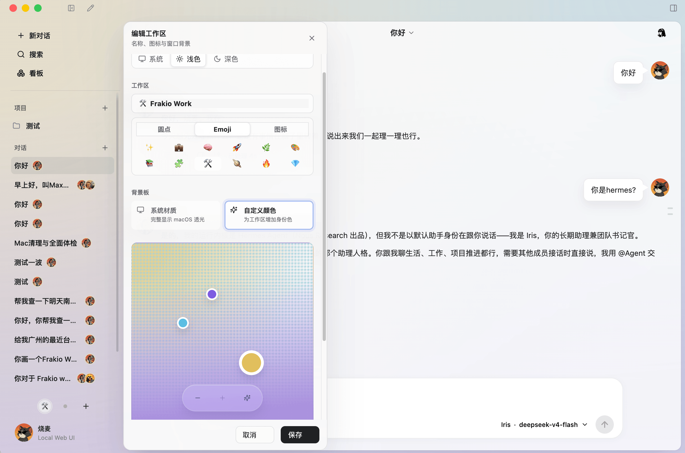

<div align="center">


<h1>Frakio Work</h1>

<p>
  <a href="https://madsgogo.com">🌱 作者主页</a>
  ·
  <a href="https://madsgogo.life">📚 博客</a>
  ·
  <a href="https://qm.qq.com/q/EMhcKWipnW">💬 QQ交流群</a>
  ·
  <a href="README.md">🇨🇳 中文</a>
  ·
  <a href="README.en.md">🇺🇸 English</a>
</p>

</div>

## 核心理念

Frakio Work 是一个多 harness 的协同工作台。你可以打造一支拥有各自性格的 Agent 团队，让它们在一个会话窗口中自然协作，并拥有长期进化型记忆，为 OPC 模式提供支撑。

Frakio Work 的核心理念是缝合。感谢以下开源项目提供的参考，排名不分先后：Hermes Agent、Hermes Studio、Pi、Codex、Craft Agent、Cindy、QM、SuperConductor、Orca。



## 沟通群


## 快速安装

macOS 桌面版可以从 [GitHub Releases](https://github.com/MadsGao/frakio-work/releases) 下载。Apple Silicon 下载 `arm64`，Intel Mac 下载 `x64`。当前安装包尚未经 Apple 签名与公证；如果 macOS 阻止首次打开，请在 Finder 中按住 Control 点击应用并选择“打开”。也可以在安装后执行：

```bash
xattr -dr com.apple.quarantine "/Applications/Frakio Work.app"
```

桌面版包含 Web UI、本地 API 和随包准备的 Runtime 文件，不需要手动运行 `npm run dev`。后续有新版本时，可以在应用设置页检查 GitHub Releases，并打开对应架构的下载页。

### 自托管 Web UI

Web UI 与桌面版使用同一套工作台。原生自托管包内置 Node、Python、Hermes Runtime 和 Bridge，不需要预装 Node、Python 或 Hermes Agent。当前提供 Windows x64 与 Linux x64 包；macOS 请使用桌面版 DMG。

Linux x64：

```bash
curl -fsSL https://raw.githubusercontent.com/MadsGao/frakio-work/main/scripts/install.sh | sh
```

Windows PowerShell：

```powershell
irm https://raw.githubusercontent.com/MadsGao/frakio-work/main/scripts/install.ps1 | iex
```

安装完成后，服务会自动启动并只显示一次管理员密码。本机访问 `http://127.0.0.1:8787`，同一可信局域网内的设备可以使用主机局域网地址登录。可信局域网 HTTP 适合私有网络；如需公网访问，请自行通过 HTTPS 反向代理接入。服务管理命令为 `frakio-work start`、`stop`、`restart`、`status`、`logs`、`update`、`rollback` 和 `password reset`。

Linux x64 还可以使用同一项目发布的 Docker 镜像：

```bash
docker run -d --name frakio-work \
  -p 8787:8787 \
  -v frakio-work-data:/data \
  -v "$PWD:/workspace" \
  ghcr.io/madsgao/frakio-work:latest
```

### 从源码开发

源码开发需要 Node.js 24、npm、Git 和 uv：

```bash
git clone https://github.com/MadsGao/frakio-work.git
cd frakio-work
npm ci
npm run runtime:build
npm run dev
```

开发模式的 Web UI 位于 `http://127.0.0.1:5173`，API 位于 `http://127.0.0.1:8787`。用户数据、密钥、日志、Runtime 和备份统一保存在 `~/.frakio-work`，不会写入源码仓库。


---

## 功能特性

### 对话中自然协作

在对话中，可以用自然语言与任何一个 Agent 沟通，就像在聊天工具的群聊中一样。Agent 之间支持最高 64 次互相 @ 的自主沟通，次数可在设置中调整。



#### 对话跟随模式切换



对话顶部可设置当前对话的多 Agent 模式：

1. 默认跟随：未 @ 其他 Agent 时，下一次回复由全局默认 Agent 完成；全局默认 Agent 可在 Agent 配置中心设置。
2. 对话跟随：@ 某个 Agent 后，后续对话由该 Agent 接管回复。
3. 转为项目：当这次对话需要形成项目时，可将它转为项目并自动加入当前工作区的项目区。
4. 资料库（Beta）：连接本地 Obsidian 仓库，调用对应资料库的规则索引，实现多 Agent 深度协作。

#### 对话快速索引



对话中提供快速跳转索引，适合消息较多时快速定位内容。

## 设置优化

### 快捷的 Agent 配置中心



1. 将零散的 Agent 配置集中为卡片，便于管理。
2. 可自定义 Agent 头像。
3. 可设置全局默认 Agent，在未指定 Agent 时作为默认回复 Agent。
4. 可设置 Agent 默认模型，在未指定模型时自动使用。

### 模型配置



模型只需配置一次，多个 Agent 可以共同使用，避免为每个 Agent 重复配置相同的模型。

### 监控美化



监控页提供可视化面板，参考 CC Switch Token 监控面板的呈现方式。

### 个人资料



个人资料页汇总 AI 使用数据，也支持自定义对话头像；该头像会出现在欢迎页和对话中。

### LLM Wiki 资料库（Beta）



资料库让 Agent 的工作文件在本地持续协作，减少对单次上下文和跨会话猜测的依赖。你可以切换不同资料库，并引用其中的规则索引来服务不同项目。

### 多工作区



可按项目开发、自媒体运营、日常对话或独立站运营等场景划分工作区。每个工作区都能设置名称、图标和颜色主题；颜色支持单色或最多三色渐变，并可调整亮度和噪声。

## 二次开发与工程架构体系

本项目已完成高内聚、低耦合的架构治理与组件化改造，并建立了标准化开发流程体系：

### 1. 核心架构与设计文档矩阵
- 📋 **[需求规格说明书](docs/需求规格.md)**：多 Agent 协同体系、双内核生活/编码定位与用户故事。
- 👥 **[面向客户的功能清单](docs/面向客户的功能清单.md)**：纯文本端功能定义与核心业务演示验证清单。
- 🏛️ **[系统架构设计说明书](docs/架构设计.md)**：分层架构图、Express 领域 Router 模式与设计决策。
- 🔄 **[系统核心流程与时序图](docs/系统核心流程.md)**：Mermaid 会话推流时序图、审批决策链与对外能力清单。
- 🔌 **[API 契约文档](docs/API契约.md)** / **[后端接口文档](docs/接口文档.md)**：RESTful 契约、SSE 协议与需求对应矩阵。
- 💾 **[数据库与存储设计](docs/数据库设计.md)**：State JSON 结构与 Hermes Profile SQLite 数据模型。
- 📘 **[二次开发快速上手指南](docs/二次开发指南.md)**：前后端解耦结构与二开接入范式。
- 🔄 **[上游同步与二开版本管理指南](docs/上游同步与二开版本管理指南.md)**：Fork + Upstream 双源模型与沙箱隔离剖析。
- 🎨 **[前端设计规范与 Token 体系手册](docs/前端设计规范与Token体系手册.md)**：统一控件高度（28px/34px/42px）与全局 Z-Index 规范。
- 🧩 **[基础与复合组件库使用手册](apps/web/src/components/BASE_COMPONENTS_GUIDE.md)**：15 个 Base 原子组件与 6 个 Composite 复合组件。
- 🧪 **[测试手册](docs/测试手册.md)** / 🚀 **[部署手册](docs/部署手册.md)** / 📊 **[功能完成情况](docs/功能完成情况.md)**：质量保障与部署验收。
- 🗄️ **[历史归档索引 (archived)](docs/archived/README.md)**：被标准文档吸收取代的历史设计草案。

### 2. 标准化开发流与门禁 (.devflow)
- 📋 **[流程状态与门禁看板 (.devflow/STATE.md)](.devflow/STATE.md)**：实时追踪 Stage 0 ~ Stage 6 的流转与门禁锁。
- 🗂️ **[产出物索引清单 (.devflow/index/artifacts.md)](.devflow/index/artifacts.md)**：登记全阶段技术规范与源码产出。
- 💡 **[核心经验与避坑指南 (.devflow/experience/README.md)](.devflow/experience/README.md)**：多内核隔离、路由拦截避坑与 Python Bridge 扩展实战。
- 📝 **[阶段复盘总结报告 (.devflow/retrospective/stage-0-to-6.md)](.devflow/retrospective/stage-0-to-6.md)**：解耦重构与规范化演进全过程复盘。

---

## 结尾

以上是 Frakio Work 当前的主要功能和优化方向。遇到问题可添加作者微信 `MadsGao`，一起讨论后续改进。

