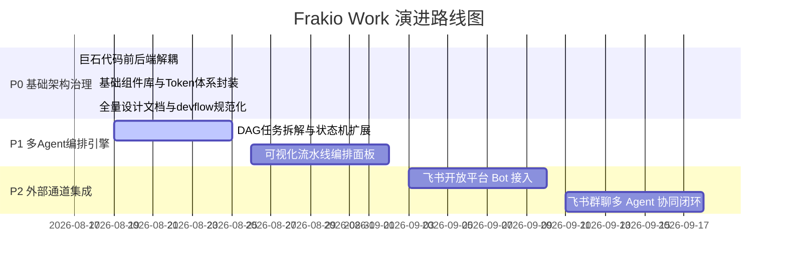

<!-- wjz新建文件，新建原因：遵循 fullstack-dev-flow stage-2 规范编写分期开发计划文档，修改时间：2026-08-18。 -->
# Frakio Work 分期开发计划

> 创建时间：2026-08-18
> 状态：已确认
> 关联流程：fullstack-dev-flow stage-2
> 关联需求：[docs/需求规格.md](file:///e:/80-project_dev/16_frakio-work(waiting%20github%20update)/docs/需求规格.md)

---

## 一、分期实施路线图

---

## 二、各期详细交付清单

### P0 期：工程架构治理与标准化规范（已达成 100% ✅）
- **核心成果**：
  1. `main.tsx` 瘦身 1.1 万行，拆解为 8 大领域组件与统一工具库；
  2. `server.mjs` 拆解为 8 大 Express Router 工厂，单元测试通过；
  3. 建立 15 个 Base 原子组件、6 个 Composite 复合组件与 `BaseIcon` 统一图标中心；
  4. 注入 `--control-height-*` 与 `--z-*` Token，业务页面全面完成组件替换；
  5. 修复 500 报错与 Python Bridge Provider 解析，调通 Kimi 等真实模型对话；
  6. 建立 Fork + Upstream Git 仓库机制并同步 GitHub；
  7. 产出 fullstack-dev-flow 标准全套设计文档矩阵。

---

### P1 期：多 Agent 调度编排引擎（下一步重点 🚀）
- **目标**：突破传统单一会话限制，支持复杂任务的多 Agent 拓扑 DAG 拆解与自动化推进。
- **交付物**：
  - 任务状态机调度器（`OrchestrationEngine`）；
  - 任务分工看板与实时进度追踪；
  - 自动化质量门禁与二次评审机制。

---

### P2 期：飞书开放平台通道集成（后续规划 🌟）
- **目标**：在飞书群聊中无缝调度 Frakio Work 的多个专职 Agent。
- **交付物**：
  - 飞书 Webhook 事件订阅与安全解密中间件；
  - 飞书卡片消息与打字机流式推流适配器；
  - 群聊 `@Agent` 协同与群内决策审批流。

---

## 三、变更记录

| 日期 | 变更内容 | 变更人 |
| :--- | :--- | :--- |
| 2026-08-18 | 初始制定 P0 ~ P2 分期开发路线图 | AI Lead + User |
<!-- wjz新建文件结束。 -->
