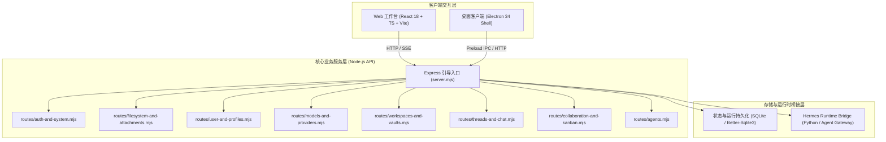

# Frakio Work 二次开发与架构扩展指南

> 本文档为研发团队提供 Frakio Work 代码库的完整架构拓扑、模块解耦结构、二次开发规范与实战扩展指南。

---

## 1. 系统架构全景 (Architecture Overview)

Frakio Work 采用 Monorepo 组织架构，分为三大核心层级：

---

## 2. 前端架构与目录规范 (`apps/web`)

### 2.1 目录拓扑

前端所有组件均按领域功能模块化拆分，杜绝单文件膨胀：

| 目录路径 | 职责定位 | 典型组件 |
| :--- | :--- | :--- |
| `src/components/common/` | 规范化基础原子组件库 | `Button`, `Input`, `Select`, `Badge`, `Card`, `Modal`, `Tooltip`, `AgentAvatar` |
| `src/components/chat/` | 消息流、提及输入框、动态时间线 | `MessageListView`, `RunActivityTimelineView`, `MentionComposer` |
| `src/components/layout/` | 顶栏、侧边栏、模态框入口 | `WorkbenchHeader`, `SidebarNav`, `QuickSettingsModal` |
| `src/components/settings/` | 设置、模型中心、插件与技能管理 | `SettingsPage`, `ModelsPage`, `HermesModulesPage`, `PluginsPage` |
| `src/components/right-rail/` | 右侧折叠工作区、上下文抽屉 | `RightRailContainer`, `WorkspaceExplorer`, `ContextDrawer` |
| `src/components/collaboration/`| 协作卡片流、决策看板、组织中心 | `CollaborationCards`, `DecisionBoard`, `OrgManagement` |
| `src/components/auth/` | Web 托管模式认证与登录门禁 | `ManagedWebAuthGate`, `ManagedWebLoginForm` |
| `src/components/qa/` | 自动化测试与启动自检面板 | `LaunchQaPanel` |
| `src/utils/` | 纯函数、API 请求客户端、格式化工具 | `api-client.ts`, `formatters.ts`, `theme-helpers.ts` |
| `src/types/` | 全局 TypeScript 接口定义 | `workbench.ts` |

### 2.2 二次开发：如何新增一个功能面板

1. **创建面板组件**：在 `src/components/` 对应领域子目录下创建组件（如 `src/components/myfeature/MyFeaturePage.tsx`）。
2. **使用基础原子组件**：优先从 `src/components/common` 引入 `Button`, `Input`, `Card`, `Modal` 等标准化组件。
3. **注册导航入口**：在 `src/main.tsx` 中的 `navItems` 数组中声明新的导航项，并在 `App()` 视图状态机中渲染该页面。

---

## 3. 后端架构与路由解耦 (`apps/api`)

### 3.1 路由模块清单

后端 API 采用 Express Router 工厂模式（Dependency Injection），所有接口按业务领域完全拆离：

| 路由文件 | 挂载前缀 | 核心接口 |
| :--- | :--- | :--- |
| `routes/auth-and-system.mjs` | `/api` | `/api/auth/*`, `/api/session`, `/api/health`, `/api/app-update/status` |
| `routes/filesystem-and-attachments.mjs`| `/api` | `/api/attachments/*`, `/api/filesystem/directories`, `/api/rich-preview` |
| `routes/user-and-profiles.mjs` | `/api` | `/api/user-profile`, `/api/hermes-profiles/*`, `/api/hermes-modules/*`, `/api/hermes/network-status` |
| `routes/models-and-providers.mjs` | `/api` | `/api/models/*`, `/api/model-providers/*`, `/api/oauth-accounts/*`, `/api/model-capabilities` |
| `routes/workspaces-and-vaults.mjs`| `/api` | `/api/state`, `/api/state/ui`, `/api/spaces/*`, `/api/workspaces/*`, `/api/monitoring/summary` |
| `routes/threads-and-chat.mjs` | `/api` | `/api/threads/:id/turns/:turnId/events` (SSE), `/api/threads/:id/runs/*` (审批/提问/中断), `/api/council/send` |
| `routes/collaboration-and-kanban.mjs` | `/api` | `/api/threads/:id/plans/*` (规划事件 SSE, 提问, 方案确认, 执行), `/api/council/simulate` |
| `routes/agents.mjs` | `/api` | `/api/agents` (新建、重命名、策略更新、级联删除) |

### 3.2 二次开发：如何新增业务 API

1. **新建路由模块**：在 `apps/api/routes/` 下创建如 `my-feature.mjs`，暴露工厂函数 `createMyFeatureRouter({ ...dependencies })`。
2. **注册路由**：在 `apps/api/server.mjs` 顶部引入并调用 `app.use('/api', createMyFeatureRouter({ ... }))`。
3. **编写单元测试**：在 `apps/api/my-feature-api.test.mjs` 中添加 Node.js 原生测试验证。

---

## 4. UI 设计规范与样式 Token

- **色彩体系**：使用 CSS 变量（如 `--mac-accent`, `--mac-surface`, `--mac-border`, `--mac-text`），自动支持深浅色与高对比度模式。
- **图标体系**：全库统一使用 `lucide-react` 矢量图标库，禁止在界面正文中裸用系统 Emoji。
- **排版字体**：使用 `font-family: "Space Grotesk", Inter, ...` 确保专业科技质感。

---

## 5. 开发与验证工作流 (Dev & Test Workflow)

### 常用命令

- **语法静态检查**：`npm run check:syntax`
- **TypeScript 编译检查**：`npm run typecheck` (`tsc -b`)
- **前端开发预览**：`npm run dev:web`
- **桌面客户端启动**：`npm start`

---
