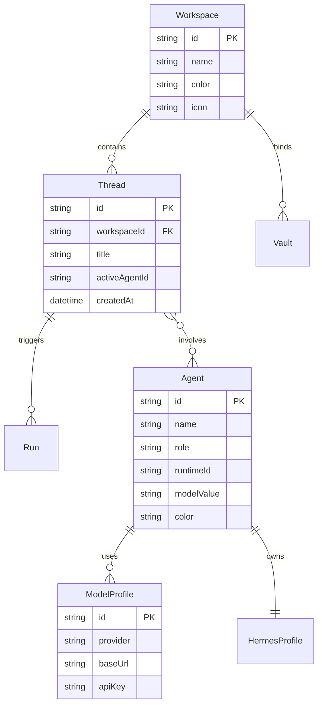

<!-- wjz新建文件，新建原因：遵循 fullstack-dev-flow stage-2 标准规范编写数据与存储模型设计说明书，修改时间：2026-08-18。 -->
# Frakio Work 数据与存储模型设计

> 创建时间：2026-08-18
> 状态：已确认
> 关联流程：fullstack-dev-flow stage-2
> 关联需求：[docs/需求规格.md](file:///e:/80-project_dev/16_frakio-work(waiting%20github%20update)/docs/需求规格.md)

---

## 一、设计原则

- **分层混合存储机制**：
  - **工作台核心状态 (Workbench State)**：采用原子写入的 JSON 文件持久化（`~/.frakio-work/workbench-state.json`），保障读写极速与全平台免数据库依赖。
  - **Agent 记忆与会话内核 (Hermes DB)**：每个 Agent 在其 Profile 沙箱目录内维护专有 SQLite 数据库（`session_db`）与 Markdown 长期记忆（`memory.md`）。
  - **本地知识资产 (Vaults)**：直接对接本地文件系统中的 Obsidian/Markdown 仓库，不进行冗余二层转存。

---

## 二、实体关系与状态模型 (ER Diagram)



---

## 三、核心数据结构清单

### 3.1 `workbench-state.json` 核心字段结构

```typescript
interface WorkbenchState {
  version: number;
  activeWorkspaceId: string;
  workspaces: Array<{
    id: string;
    name: string;
    rootPath?: string;
    color?: string;
    accentColor?: string;
  }>;
  agents: Array<{
    id: string;
    name: string;
    role: string;
    runtimeId: 'hermes' | 'pi' | 'codex' | 'claude';
    modelValue: string;
    profileName?: string;
    avatarUrl?: string;
    soul?: string;
  }>;
  models: Array<{
    id: string;
    provider: string;
    baseUrl: string;
    apiKey: string;
    models: string[];
  }>;
  threads: Array<{
    id: string;
    workspaceId: string;
    title: string;
    primaryAgentId: string;
    updatedAt: string;
    archivedAt?: string;
  }>;
  ui: {
    appearance: 'system' | 'light' | 'dark';
    density: 'comfortable' | 'compact';
    streamingResponses: boolean;
  };
}
```

### 3.2 Hermes SQLite 数据表模型

每个 Hermes Profile 内部的 SQLite 包含：
- **`sessions`**：会话元数据与时间戳；
- **`messages`**：消息历史流与 Token 消耗统计；
- **`tool_calls`**：工具执行入参与产物索引；
- **`memories`**：长期知识提炼与语义分块。

---

## 四、变更记录

| 日期 | 变更内容 | 变更人 |
| :--- | :--- | :--- |
| 2026-08-18 | 基于 fullstack-dev-flow stage-2 规范初始建立数据存储设计文档 | AI Lead + User |
<!-- wjz新建文件结束。 -->
