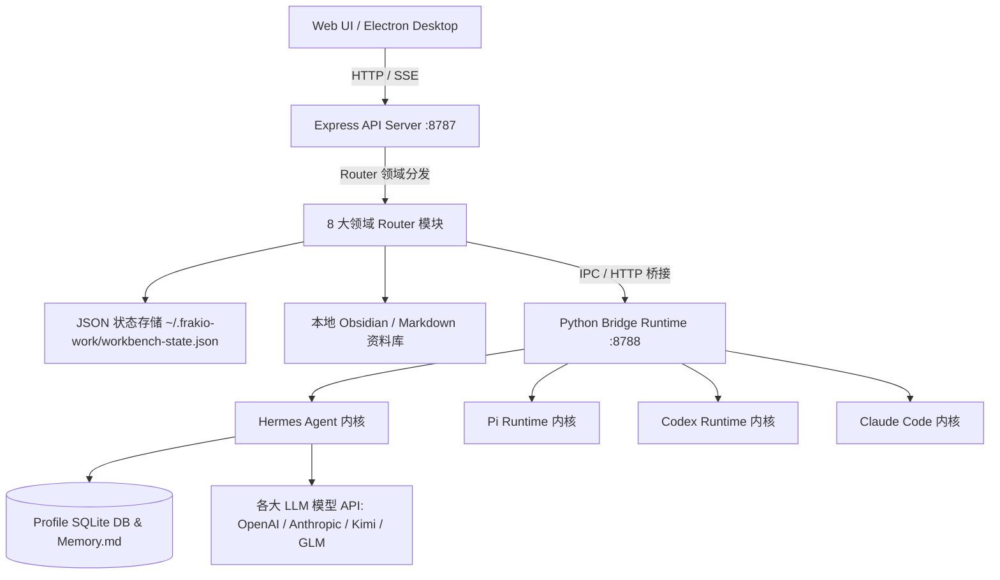

<!-- wjz新建文件，新建原因：遵循 fullstack-dev-flow stage-2 标准规范编写系统架构设计说明书，修改时间：2026-08-18。 -->
# Frakio Work 架构设计文档

> 创建时间：2026-08-18
> 状态：已确认
> 关联流程：fullstack-dev-flow stage-2
> 关联需求：[docs/需求规格.md](file:///e:/80-project_dev/16_frakio-work(waiting%20github%20update)/docs/需求规格.md)

---

## 一、技术栈选型

| 架构层级 | 技术选型 | 版本 | 核心说明 |
| :--- | :--- | :--- | :--- |
| **前端应用 (Web / Desktop UI)** | React + TypeScript + Vite + Radix UI + Motion | React 19.x, Vite 7.x | 响应式工作台，基于 Design Tokens 与 Base 组件库构建 |
| **桌面端壳层** | Electron | 34.x | 原生 macOS/Windows 桌面封装与窗口管理 |
| **主后端 API 服务** | Node.js + Express (ESM) | Node 24.x, Express 4.x | 领域路由工厂、SSE 推流、状态持久化与进程调度 |
| **Agent Bridge (运行时桥接)** | Python + FastAPI + Uvicorn + uv | Python 3.10+, uv | Hermes Agent 执行引擎、多内核调度与长期记忆提取 |
| **契约库 (Contracts)** | @frakio/contracts | 1.1.0 | 前后端与 Python 桥接层统一共享的 TypeScript/JSON Schema 契约 |
| **持久化存储** | JSON State + SQLite (Hermes) | - | 工作台状态保存在 `~/.frakio-work`，Hermes 数据保存在独立的 Profile SQLite 数据库中 |

---

## 二、分层架构

### 2.1 整体分层架构图



### 2.2 前端分层结构

```
apps/web/src/
├── components/
│   ├── base/               # 原子基础组件 (BaseButton, BaseInput, BaseIcon 等)
│   ├── composite/          # 复合业务组件 (BaseTabs, BaseSection, BaseSettingsLayout 等)
│   ├── chat/               # 会话流、打字机渲染、模型选择器与动态时间线
│   ├── settings/           # 模型中心、Agent组织、资料库与系统设置
│   ├── layout/             # 顶栏、导航侧边栏、分栏拖拽手柄
│   ├── right-rail/         # 协作全景盘、内嵌浏览器、文件树与差异审阅
│   ├── collaboration/      # 协作卡片流、决策托盘与权限审批
│   └── auth/               # 密码门禁与安全验证
├── types/                  # 全局类型定义 (workbench.d.ts 等)
├── utils/                  # 纯函数、格式化器与 API Client
└── styles.css              # 全局 Design Tokens (--control-height-*, --z-*) 与样式
```

### 2.3 后端分层结构

```
apps/api/
├── server.mjs              # 引导入口、中间件装配与环境探测
└── routes/                 # 8 大领域独立 Router 工厂
    ├── auth-and-system.mjs           # 认证、密码管理与系统控制
    ├── filesystem-and-attachments.mjs# 文件浏览、图片上传与附件托盘
    ├── user-and-profiles.mjs         # 用户资料与 Hermes 引导配置
    ├── models-and-providers.mjs      # 模型中心、API Key 映射与连通测速
    ├── workspaces-and-vaults.mjs     # 多工作区、Vaults 索引与代码审阅
    ├── threads-and-chat.mjs          # 会话流、SSE 流式推流与打字机
    ├── collaboration-and-kanban.mjs  # 协作卡片、计划分支与决策审批
    └── agents.mjs                    # Agent 团队管理与 Profile 存储
```

---

## 三、关键设计决策

### 3.1 为什么采用 Router 工厂与依赖注入？
- **决策**：将 2.4 万行巨石 `server.mjs` 解耦为 8 个 Router 工厂函数 `createXRouter(deps)`。
- **理由**：通过显式参数注入共享状态（`stateFile`, `workspaces`, `threads`, `agents`），避免全局变量污染，消除路由阴影冲突，利于单测与后续扩展。

### 3.2 为什么设计 BaseIcon 统一图标中心？
- **决策**：封装 `<BaseIcon name="..." />`，收拢 80+ 个 Lucide 矢量图标与项目专属 SVG。
- **理由**：彻底杜绝在每个业务组件中分散 `import` 几十个散落图标，消除包体积碎片化，实现统一尺寸与旋转动画控制。

---

## 四、变更记录

| 日期 | 变更内容 | 变更人 |
| :--- | :--- | :--- |
| 2026-08-18 | 基于 fullstack-dev-flow stage-2 规范初始建立架构设计文档 | AI Lead + User |
<!-- wjz新建文件结束。 -->
