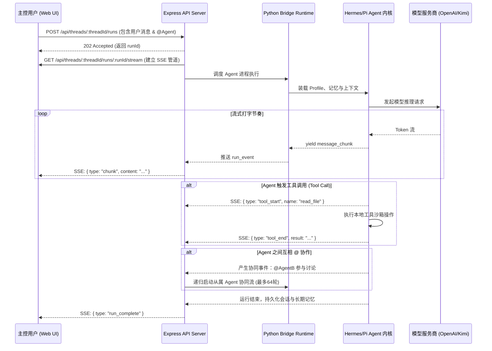
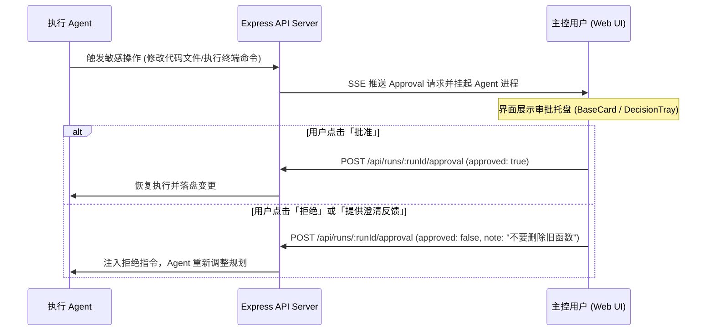

<!-- wjz新建文件，新建原因：遵循 fullstack-dev-flow stage-2 标准规范编写系统核心流程文档，修改时间：2026-08-18。 -->
# Frakio Work 系统核心流程与对外能力清单

> 本文档浓缩系统的业务全貌：核心时序图 + 对外能力清单 + 外部依赖与降级链 + 数据表速览。
> 关联流程：fullstack-dev-flow stage-2
> 关联需求：[docs/需求规格.md](file:///e:/80-project_dev/16_frakio-work(waiting%20github%20update)/docs/需求规格.md)
> 关联架构：[docs/架构设计.md](file:///e:/80-project_dev/16_frakio-work(waiting%20github%20update)/docs/架构设计.md)

---

## 一、设计原则

| 维度 | 设计选择 | 理由 |
| :--- | :--- | :--- |
| **状态源** | `~/.frakio-work/workbench-state.json` + Hermes SQLite | JSON 维护工作区/会话元数据，SQLite 维护 Agent 记忆与会话历史 |
| **运行时调度** | Python Bridge 子进程池 | 利用 Python 原生支持多内核沙箱并承接 Hermes/Pi 的执行调度 |
| **推流协议** | Server-Sent Events (SSE) | 单向流式下发打字机事件、工具调用过程与审批中断信号 |
| **环境隔离** | Profile 沙箱与专有 Home 路径 | 绝对禁止污染用户操作系统全局环境与 CLI 配置 |

---

## 二、核心时序图

### 流程 1：多 Agent 协同流式对话与工具执行

### 流程 2：敏感操作审批（Approval）与决策托盘

---

## 三、对外能力清单（业务域分组）

### 1. 会话与运行域 (`threads-and-chat`)

| 接口名称 | HTTP 方法与路径 | 标签 | 对应存储实体 | 用途说明 |
| :--- | :--- | :--- | :--- | :--- |
| `listThreads` | `GET /api/threads` | R | `state.threads` | 获取工作区下的所有会话列表 |
| `createRun` | `POST /api/threads/:id/runs` | W | `threads[].runs` | 发起 Agent 对话运行任务 |
| `runStream` | `GET /api/threads/:id/runs/:runId/stream` | R | SSE 内存管道 | 建立流式实时打字机与工具调用推流 |
| `submitApproval` | `POST /api/runs/:runId/approval` | W | `runs[].approval` | 提交敏感操作审批决策 |

### 2. 团队 Agent 域 (`agents`)

| 接口名称 | HTTP 方法与路径 | 标签 | 对应存储实体 | 用途说明 |
| :--- | :--- | :--- | :--- | :--- |
| `listAgents` | `GET /api/agents` | R | `state.agents` | 获取全量团队 Agent 列表与配置 |
| `saveAgent` | `POST /api/agents` | W | `state.agents` | 创建或更新 Agent 资料、头像与内核 |
| `deleteAgent` | `DELETE /api/agents/:id` | D | `state.agents` | 删除指定 Agent 及其关联 Profile |

### 3. 模型中心域 (`models-and-providers`)

| 接口名称 | HTTP 方法与路径 | 标签 | 对应存储实体 | 用途说明 |
| :--- | :--- | :--- | :--- | :--- |
| `listModels` | `GET /api/models` | R | `state.models` | 获取所有已配置的模型渠道列表 |
| `testModel` | `POST /api/models/test` | R | 内存网络探测 | 测试特定模型渠道连通性与延迟 |

---

## 四、外部依赖与降级链

| 依赖组件 | 核心用途 | 失败时的降级方案 |
| :--- | :--- | :--- |
| **主 LLM 服务商** | 对话推理与代码生成 | 自动切换至备用模型或提示用户检查 API Key / 网络代理 |
| **Python Bridge** | Hermes/Pi 内核调度 | 检测到子进程退出时自动重启 Python Bridge 服务 |
| **本地 Vaults 资料库** | 外部 Obsidian 知识检索 | 资料库不可读时自动降级为标准上下文对话模式 |
<!-- wjz新建文件结束。 -->
